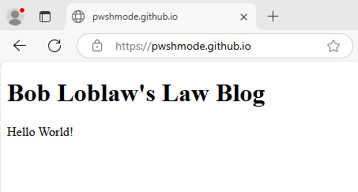
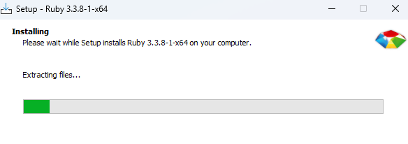
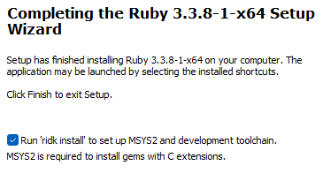
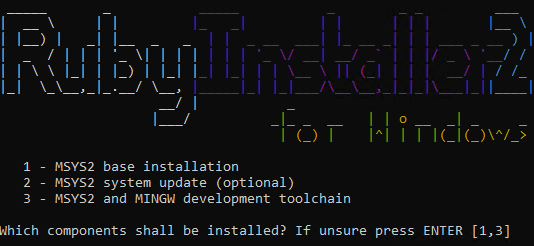
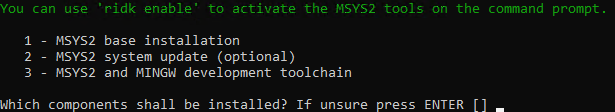
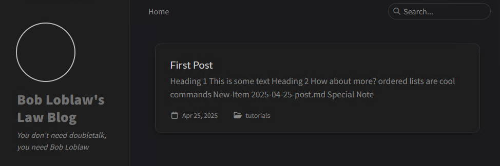
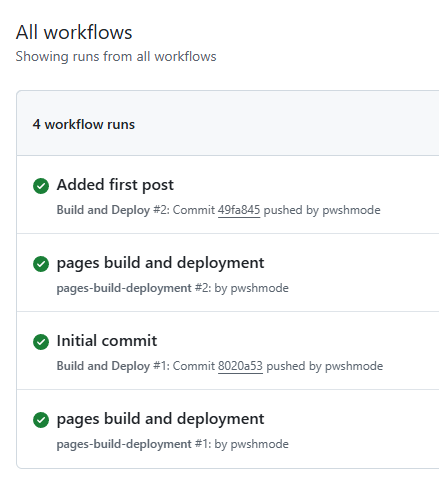

## Building a website

So, you’ve got something to say? A project you’re excited about? Or maybe just a burning desire to share your thoughts with the world? Starting a blog can seem like a huge undertaking, but it doesn’t have to be. So let's do this together! In this post, I’ll walk you through the process of launching your own website, leveraging the power of GitHub Pages and the flexibility of Jekyll to build a functional blog incredibly easy.

### What is GitHub Pages?

GitHub Pages is a free service offered by GitHub that lets you host static websites directly from your GitHub repositories. You don’t need to worry about servers or complex hosting setups. Just upload your website files to a public GitHub repository, and GitHub Pages will handle the rest.

### What is Jekyll?

Jekyll is a static site generator. It is a tool that takes your content (written in Markdown) and transforms it into a fully functional website. It’s also supported by a vibrant and helpful community, offering plenty of resources and support for new users. It’s a fantastic option for those of us whose graphic design skills peaked with MS Paint

## Part 1 - The Basics

### Signing up for GitHub

First and foremost, you are going to need a GitHub account. You can use the link below to sign up:

[Signup for GitHub](https://github.com/signup)

Once you've created your account you'll want to create a new repository. Make sure you set the repository name to be `*username*.github.io`. You'll also want to set this repository to be **public**.


After you've created your repository you will want to install Git on your computer. You could opt for the GitHub Desktop app but I'm going to stick with Git for Windows for this tutorial. It can be downloaded at the link below.

[Git for Windows](https://gitforwindows.org/)

**Note**: I generally stick with most of the default options during the install but I do set Visual Studio Code to be the default editor for Git. I also set the default branch name for new repositories to be "main".

You can verify that Git is installed by running `git -v`. If Git is installed then it will display the current installed.

```powershell
> git -v
git version 2.49.0.windows.1 # indicates a successful install
```

Now that you have Git installed let's take care of some housekeeping. You will need to set your username and email for Git. Setting your username and email in Git is essential for proper authorship tracking, collaboration, and attribution. Use the following commands to set your identity.

```bash
git config --global user.name "pwshmode"
git config --global user.email "pwshmode@proton.me"
```


Now we want to clone the repository that we created earlier.

```bash
git clone https://github.com/username/username.github.io.git
```

Now we have a directory on our local machine that contains all of our repository's files. Which is not really anything at this point.

Let's go ahead and create a basic `index.html` file

```html
<!DOCTYPE html>  
<html>  
<body>  
  
<h1>Bob Loblaw's Law Blog</h1>  
<p>Hello World!</p>  
  
</body>  
</html>
```

Now let's add our changes. 

```bash
# Adds all files
git add .

# You can check that the index.html file is added with
git status
```

Now let's commit our changes and add a message (if you didn't set your identity earlier it will inform you about that now).

```bash
git commit -m "Added index.html"
```

We are ready to push our changes now.

```bash
git push origin main
```

You may be prompted to sign into GitHub if you haven't already done so. 

Congratulations! You've made your first GitHub Pages website and it's beautiful. 



(Note: beauty is subjective). We could stop there, but where is the fun in that?

# Part 2 - Introducing Jekyll

> For this section we are going to delete the previous repository and use a template.

We mentioned earlier that Jekyll is a static site generator and it has a thriving community. We want to take advantage of the graphic/web design prowess of others that have come before us. They've so generously contributed their work and it would be a shame not to use it. There is a whole slew of themes out there free for the taking. You can find some popular ones on GitHub:

[Jekyll Themes on GitHub](https://github.com/topics/jekyll-theme)

### Creating a repository from a template

For the demonstration here we're going to be using theme [Chirpy](https://github.com/cotes2020/jekyll-theme-chirpy). There are lots of great notes about how to [get started](https://chirpy.cotes.page/posts/getting-started/) with this theme.

We are going to use the chirpy-starter [template]([cotes2020/chirpy-starter: A website startup template using the Chirpy theme gem.](https://github.com/cotes2020/chirpy-starter)). Remember we deleted the repository from part one so we can click `Use this template` and `Create a new repository`. We are going to set the name to `username.github.io`.

### Installing dependencies

Now we need to prepare our development environment. This theme offers two different ways: Dev Containers or setting it up natively. While Dev Containers are recommended for Windows, for the sake of this tutorial we are going to install the necessary prerequisites and go from there. Here is the documentation for installing [Jekyll on Windows]([Jekyll on Windows | Jekyll • Simple, blog-aware, static sites](https://jekyllrb.com/docs/installation/windows/)). 

#### Installing Ruby

Download the Ruby+Devkit installer from [RubyInstaller Downloads](https://rubyinstaller.org/downloads/). (v3.3.8-1 is the recommended installer at the time of this post).



Be sure the Run `ridk install` option is selected.



Then press `ENTER` when selecting the components to install the base installation and the MINGW development toolchain. 




You can verify that Ruby is installed by opening a new terminal window and running `ruby -v`. That will return the version of Ruby that you installed.

#### Installing Jekyll

You can install Jekyll by running:

```
gem install jekyll bundler

# Verify that jekyll is installed
jekyll -v
```

Now that our dependencies are installed let's move on to building the website.
### Cloning the repository and building the website

Let's clone the repo again to pull down the files from the template we grabbed earlier. 

> Note: You may want to delete the local repository directory from the earlier example.

```bash
git clone https://github.com/pwshmode/pwshmode.github.io.git

# Change directory
cd .\pwshmode.github.io\

# Open the directory in VSCode for ease of editing
code .
```

#### Install dependencies...again

For this particular theme you will need to run `bundle` in the root of your repository to install additional dependencies. 

### Start the local server

Now that the dependencies are installed we can take a sneak peak at what our website will look like. 

```
bundle exec jekyll s
```

Your local website will be available for viewing at [127.0.0.1:4000](http://127.0.0.1:4000)

We could push these changes up to Github and view the site but let's add some information first.

#### Edit `_config.yml`

```yml
timezone: America/Chicago
title: Bob Loblaw's Law Blog
tagline: You don't need doubletalk, you need Bob Loblaw
description: A law blog by Bob Loblaw Law Firm
url: "https://pwshmode.github.io"
github:
	username: pwshmode
social:
	name: Bob Loblaw
	email: pwshmode@proton.me
```

> We can view changes by stopping the previous server instance and running `bundle exec jekyll s`. Be sure you have saved your `_config.yml` file.

#### Create your first post

Under `_posts` we want our first "real" post. Create a file and use the following format for the name `YYYY-MM-DD-title.md`. Now let's add in the frontmatter and content.

>**What is front matter?**
>In Jekyll, frontmatter is a special section at the _very beginning_ of a Markdown or text file (usually a blog post, page, or other content file). It's enclosed between three dashes (`---`) at the top and three dashes again at the bottom. Think of it as a metadata header for your content.


```md
---
title: First Post
date: 2025-04-25 12:16:10 -0500
categories: [tutorials]
tags: [blog,jekyll]
---

# Heading 1

This is some text

## Heading 2

How about more?

- lists
- are
- cool

`commands`

```powershell
New-Item 2025-04-25-post.md
```
```
```

We can refresh our browser and see our new post.



> You can also preview the markdown file directly in VSCode by selecting the preview icon.


### Push your changes to GitHub

Stage your changes:

```bash
# Stages all modified files
git add .
```

Commit your changes and add a message:

```bash
git commit -m "Added new post"
```

Push your changes up to GitHub:

```bash
git push
```

### View your new post 

After pushing your changes and waiting just a bit, navigate to your github pages URL to see it in action! 

*Note: You may need to clear your browser's cache if the content hasn't updated.*

You want to know something really cool about this process? The build for your webpage was done through **GitHub Actions**. You can see this process by navigating to the `Actions` tab under your repository. 



This theme contained a workflow that automatically builds our site using `jekyll build` and deploys the results to Github Pages. This eliminates the manual build and deployment steps for us. You can find the "workflow" under `.github\workflows\pages-deploy.yml`.

# Part 3 - Integrating Obsidian

I use Obsidian quite a lot for my own personal notetaking. It's very functional out of the box and can become quite powerful when you add in a few plugins. Because it is something I use on a daily basis I thought it would a great idea to use it as


